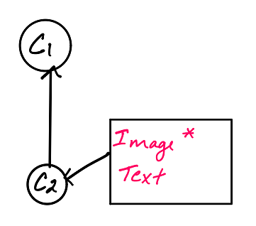
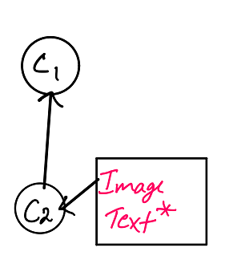

# Learning Git
## Checkout

The checkout command helps to prepare working on a branch. It switches to the branch by updating the index and the files in the working tree.

### Syntax 

```
git checkout "branchname"

```
### Example

There are 2 branches, `Image` and `Text` in the commit C2. The branch `Image` is currently selected (denoted by the *)



If we want to work on the branch `Text`, we do:
```
git checkout Text
```


As we can see, now the branch `Text is selected.
