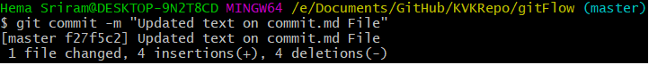
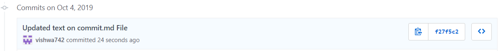

# Learning Git
## Commit 

A commit in a git repository records all the changes in the repository. A Git commit is a snapshot of the hierarchy and the contents of the files in a Git repository.

#### Three main commits

|   | Message |  All | Amend |
| - | ------- | ---- | ----- |
| Syntax | -m | -a | --amend |
| Function| Sets the commit message | Includes all unchaged files in the commit | Rewrites the last commit |

### Example

We have added some text to a file called commit.md on the local repository. Before we push this to github, we will have to make a commit explaining the changes made 



```
git commit -m "Added text to commit.md File"
```

