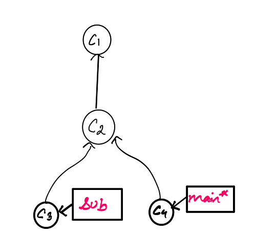
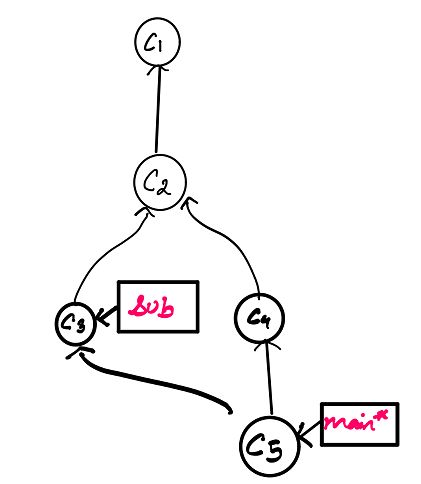

# Learning Git
## Merge

Merging allows you to combine the work from two different branches together. Merging in Git creates a special commit that has two unique parents. Merging allows us to branch off, develop a new feature, and then combine it back in.

### How to merge 

In order to merge branch1 into branch2, branch2 must be selected (This can be done using checkout). We use the command:

```
git merge branch1
```

### Example

We have 2 commits, C3 and C4. C3 contains the branch `sub` and C4 contains the branch `main`. We wish to merge these commits so that there will be one commit which contains the feature of both `sub` and `main`



The branch `main` is selected (denoted by the * symbol)

We use the command: git merge `sub`. 



This will merge the branch `sub` into the branch `main`. A new commit, C5 is created and this contains the contents of both `sub` branch and `main` branch.