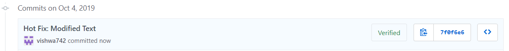
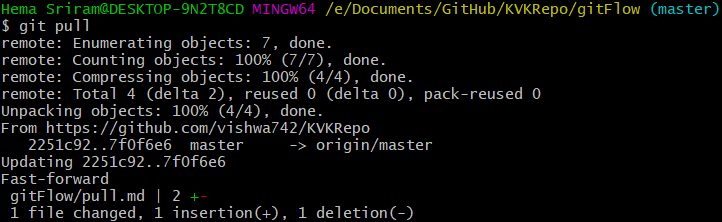

# Learning Git
## Pull

Pull does the opposite of what push does. The git pull command is used to fetch and download content from a remote repository and immediately update the local repository to match that content.

### Example 

We made a change in github and added a commit. We can use git pull to download the changes so that it reflects in the local repository. 

Now the changes made in github will be reflected in the local repository